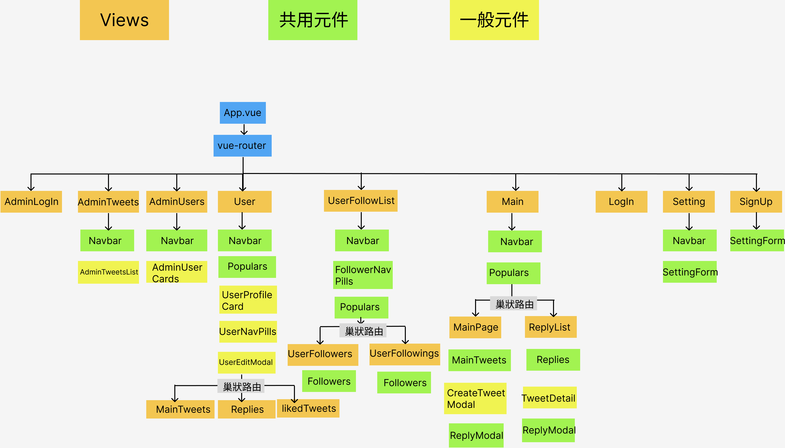
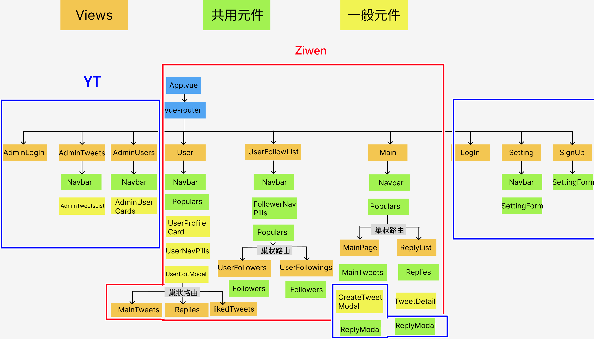

# 2022/07/24 - 第 1 次前端小組會議

## 會議資訊
**時間：** 2022/07/24 14:00~18:30  
**地點：** Discord 小組語音頻道  
**與會人員：** 
  * 前端 - YT、Ziwen  

**會議主題：**  
* [確認專案基本設定](#確認專案基本設定)  
* [元件拆分](#元件拆分)  
* [工作分配](#工作分配)  
* [下次會議預定](#下次會議預定)  

## 會議內容  

### 確認專案基本設定  
  - 已完成專案基礎建置並推到GitHub
  * [前端 GitHub](https://github.com/ziwenying/simple-twitter-frontend)
  
### 元件拆分  

#### 資料分析
 - [分析文件]()

##### 待討論-> 07/25 前後端共同會議解決
  1. tweets, followers等資料如何確定當前使用者是否按讚或追蹤狀態(原資料長相?)  
       - 後端回覆：需傳入追蹤和被追蹤者的id
  3. 新增的留言或推文： 只需要回傳內容給後端，就會自動生成誰留的, id, 發表時間等資訊嗎? 
       - 後端回覆：推文須回傳推文內容和user id；留言要留言內容、user id、留言那篇推文的id

#### 路由 (前端使用的網址)
  - 登入頁面(LogIn)：  `/login` 
    - 登入後自動轉址到 `/main/mainpage`
  - 註冊頁面(SignUp)：    `/signup` 
  - 編輯資料(Setting)：  `/users/:id/edit`
  - 首頁 (Main)：     `/main`  (直接轉址 `/main/mainpage`)
      - 主要頁面(MainPage)：  `/main/mainpage`
      - 回覆清單(ReplyList)： `/main/replylist/:id`
  - 追蹤清單(UserFollowList)：  `/users/:id/followlist` -> 直接轉址 `/followlist/followers`
    - 追蹤我(UserFollowers)： `/users/:id/followlist/followers`
    - 我正在追蹤(UserFollowings)： `/users/:id/followlist/followings`
  - 使用者頁面(User)：   `/users/:id` -> 直接轉址 `/users/:id/tweets`
      - 推文(MainTweets)：      `/users/:id/tweets`
      - 推文與回覆(Replies)：  `/users/:id/replies`
      - 喜歡的內容 (likedTweets)： `/users/:id/liked`
  - 後台登入(AdminLogin)： `/admin/login`    
    - 登入後自動轉址到`/admin/tweets`
  - 後台推文清單(AdminTweets)： `/admin/tweets`
  - 後台使用者列表(AdminUsers)：  `/admin/users`

### 工作分配
 - 待工作分配整理圖
 

### 練習git指令與PR
 - 新增分支
 - 合併分支
 - 拉取遠端分支
 - 發送pull request

## 相關連結  
* [回首頁](../README.md)
* [會議記錄總表](./index.md)  
