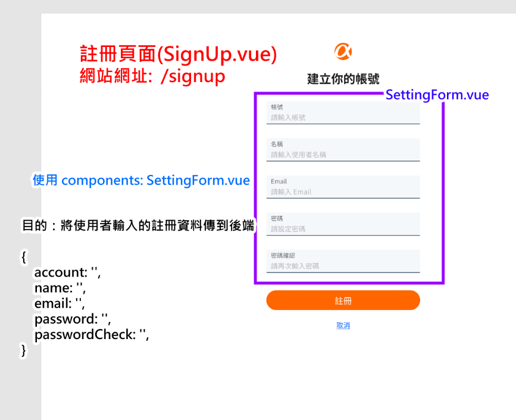

# Simple Twitter  07/24 第一次前端會議： 元件及資料分析整理表 

## 頁面元件與資料分析

  


* [前台大地圖](./images/前台大地圖.jpg)  
* [後台大地圖](./images/後台大地圖.jpg)  


### 註冊頁




- 頁面元件
  - views/SignUp.vue 
  - components: SettingForm.vue

- 頁面資料
    目的：將使用者輸入的註冊資料傳到後端

    ```
    { 
        account: '',
        name: '',
        email: '',
        password: '',
        passwordCheck: '',
    }
    ```
    
    - 資料型別及說明：**物件**，其中包含下列資料

        | 資料名稱      | 資料型別 | 資料說明         |
        | ------------- | -------- | ---------------- |
        | account       | String   | 使用者帳號       |
        | name          | String   | 使用者名稱       |
        | email         | String   | 使用者信箱       |
        | password      | String   | 使用者密碼       |
        | passwordCheck | String   | 再次輸入密碼確認 |
   

 - router: `/signup` 

### 前台登入頁

  


 - 頁面元件
   - views/LogIn.vue
   - components: 無
 - 頁面資料
     目的： 發送使用者帳密到後端，驗證使用者權限
     ```
        { 
            account: '',
            password: '',
        }
        
    ``` 
    - 資料型別及說明：**物件**，其中包含下列資料

        | 資料名稱 | 資料型別 | 資料說明   |
        | -------- | -------- | ---------- |
        | account  | String   | 使用者帳號 |
        | password | String   | 使用者密碼 |

 - router: `/login` 

### 個人資料設定

  


 - 頁面元件
   - views/SettingForm.vue 
   - components: 
     - Navbar.vue
     - SettingForm.vue
 - 頁面資料
   - currentUser (vuex) => 目的：判斷使用者是否有權限進入個人資料設定頁面
     ```
     currentUser: {
      id: -1,
      name: '',
      email: '',
      avatar: '',
      isAdmin: false
     } 
     ```
     - 資料型別及說明：回傳**物件**，其中包含下列資料

         | 資料名稱 | 資料型別 | 資料說明         |
         | -------- | -------- | ---------------- |
         | id       | Number   | 使用者id         |
         | name     | String   | 使用者名稱       |
         | email    | String   | 使用者信箱       |
         | avatar   | String   | 使用者大頭貼     |
         | isAdmin  | Boolean  | 是否為管理員身分 |
        
     - 註：currentUser可獨立一條路由拉取資料，前端會將資料儲存在全域，就不用在每個頁面都拉取資料，因此下面還有需要currentUser資料的頁面，和這裡的資料內容一樣，不再詳細贅述。
     
   - user (vue) => 目的：使用者編輯完個人資料後，傳送到後端更新資料

        ```
         user: { 
            account: '',
            name: '',
            email: '',
            password: '',
            passwordCheck: '',
         }
        ```
 
     - 資料型別及說明：**物件**，其中包含下列資料

        | 資料名稱      | 資料型別 | 資料說明         |
        | ------------- | -------- | ---------------- |
        | account       | String   | 使用者帳號       |
        | name          | String   | 使用者名稱       |
        | email         | String   | 使用者信箱       |
        | password      | String   | 使用者密碼       |
        | passwordCheck | String   | 再次輸入密碼確認 |
        
 
 - router: `/users/:id/setting`


### 首頁(父層 Main.vue 有兩個子層 MainPage.vue 和 ReplyList.vie)
  

### 首頁 tweets 總表 


 - 頁面元件
   - views/Main.vue 
   - components: 
     - Navbar.vue
     - MainTweets.vue
     - Populars.vue
  
 - 頁面資料
   - Main.vue : 這邊列出此頁面需要的所有資料，就是回傳這一包，下面會再詳細說明各資料內部需要的內容
     ```
         {
          currentUser: {}, 
          tweets: [],
          users: [],
          newTweet:'',
         }
        ```
     - currentUser => 目的：渲染中間上方撰寫推文的使用者頭像
     - tweets => 目的： 渲染中間的tweets列表 
       -  **陣列**，內含多個**物件**，每個物件中包含資料如下：
            
         ```
           tweets: [
             {
               id: -1,
               text: '',
               user: {
                 id: -1,
                 name: '',
                 avatar: '',
                 account: ''
               },
               createdAt: '',
               isLiked: false,
               likeCount: 0,
               commentCount: 0
             },
           ]
         ```
        
       | 資料名稱     | 資料型別 | 資料說明         |
       | ------------ | -------- | ---------------- |
       | id           | Number   | 推文的id         |
       | text         | String   | 推文內容         |
       | user         | Object   | 推文的使用者資料 |
       | user.id      | Number   | 推文的使用者id   |
       | user.name    | String   | 推文的使用者名稱 |
       | user.avatar  | String   | 推文的使用者頭像 |
       | user.account | String   | 推文的使用者帳號 |
       | createdAt    | String   | 推文發布時間     |
       | isLiked      | Boolean  | 是否按讚         |
       | likeCount    | Number   | 按讚數           |
       | commentCount | Number   | 留言數           |
           
     - users => 目的： 渲染右側活躍使用者版面
       - **陣列**，內含多個**物件**，每個物件中包含資料如下： 

        ```
        users: [
         {
            id: -1,
            name: "",
            avatar: "",
            isFollowed: false
          },
       ]
       ```
       
       | 資料名稱   | 資料型別 | 資料說明   |
       | ---------- | -------- | ---------- |
       | id         | Number   | 使用者id   |
       | name       | String   | 使用者名稱 |
       | avatar     | String   | 使用者頭像 |
       | isFollowed | Boolean  | 是否被跟隨 |


       ```
       newTweet: {
         user: {
          id: -1,
          name: '',
          avatar: '',
          account: '',
         },
         tweetText: '',
         likeCount: 0,
         commentCount :0
       }
       ```
   
       | 資料名稱     | 資料型別 | 資料說明         |
       | ------------ | -------- | ---------------- |
       | newTweets    | Object   | 新增的推文資料   |
       | user         | Object   | 推文的使用者資料 |
       | user.id      | Number   | 推文的使用者id   |
       | user.name    | String   | 推文的使用者名稱 |
       | user.avatar  | String   | 推文的使用者頭像 |
       | user.account | String   | 推文的使用者帳號 |
       | tweetText    | String   | 新增的推文       |
       | likeCount    | Number   | 按讚數           |
       | commentCount | Number   | 留言數           |
        
        
       - Navbar.vue -> 父元件傳入 currentUser 
       - MainTweets.vue -> 父元件傳入 tweets 
       - Populars.vue -> 父元件傳入 users   
   
 - router: `/main/mainpage`

### 在首頁中新增 tweet


 - 頁面元件
   - views/Main.vue
   - components: CreateTweetModal.vue
 - 頁面資料
   - CreateTweetModal.vue 
      ```
         {
          currentUser: {}, 
          newTweet:{},
          isShowed: true
         }
        ```
     - currentUser => 目的：渲染撰寫推文的使用者頭像 
     - NewTweet => 目的：記錄使用者寫的推文內容, 傳送到後端 
        
     - isShowed => 目的： 根據狀態顯示Modal (**此資料由前端產生**) 
 - router: `/main/mainpage`


### 首頁回覆 modal


 - 頁面元件
   - views/Main.vue
   - components: ReplyModal.vue
 - 頁面資料
   - ReplyModal.vue
     ```
     {
       currentUser: {},
       tweet: {},
       newReply: '',
       isShowed: true
     }
      ```
     - currentUser  => 目的： 渲染撰寫推文的使用者頭像
     - tweet of tweets -> 由父元件 MainPage.vue 傳入 MainTweets.vue 再傳ReplyModal.vue  
     - newReply => 目的：記錄使用者寫的留言內容, 傳送到後端
       
        | 資料名稱 | 資料型別 | 資料說明       |
        | -------- | -------- | -------------- |
        | newReply | String   | 新增的留言內容 |
        
     - isShowed => 目的： 根據狀態顯示Modal (**此資料由前端產生**) 
 - router: `/main/mainpage`

### 單一 tweet 回覆清單


 - 頁面元件
   - views/ReplyList.vue
   - components: 
     - Navbar.vue
     - TweetDetail.vue
     - Replies.vue
     - Populars.vue
 - 頁面資料
   - ReplyList.vue : 這邊列出此頁面需要的所有資料，下面會再詳細說明各資料內部需要的內容 
     ```
     {
       currentUser: {}, 
       tweet: {
         ...,
         replies: [],
       },
       users: []
     }
     ```
     - tweet => 目的：取得單一則tweet的內容及發佈者訊息、獲得的留言內容
         ```
          tweet : {
               id: -1,
               text: '',
               user: {
                 id: -1,
                 name: '',
                 avatar: '',
                 account: ''
               },
               createdAt: '',
               isLiked: false,
               likeCount: 0,
               commentCount: 0,
               replies: [],
          }, 
         ```
         | 資料名稱     | 資料型別 | 資料說明           |
         | ------------ | -------- | ------------------ |
         | id           | Number   | 推文的id           |
         | text         | String   | 推文內容           |
         | user         | Object   | 推文者的使用者資料 |
         | user.id      | Number   | 推文者的使用者id   |
         | user.name    | String   | 推文者的使用者名稱 |
         | user.avatar  | String   | 推文者的使用者頭像 |
         | user.account | String   | 推文者的使用者帳號 |
         | createdAt    | String   | 推文發布時間       |
         | isLiked      | Boolean  | 是否被按讚         |
         | likeCount    | Number   | 按讚數             |
         | commentCount | Number   | 留言數             |

     - tweet中的 replies  => 目的：渲染留言區
       - **陣列**，內含多個**物件**，每個物件中包含資料如下： 
            ```
              replies : [
                {
                   id: -1,
                   text: '',
                   user: {
                     id: -1,
                     name: '',
                     avatar: '',
                     account: ''
                   },
                   createdAt: '',
                }, 
              ]
          ```
            | 資料名稱     | 資料型別 | 資料說明           |
            | ------------ | -------- | ------------------ |
            | id           | Number   | 留言的id           |
            | text         | String   | 留言內容           |
            | user         | Object   | 留言者的使用者資料 |
            | user.id      | Number   | 留言者的使用者id   |
            | user.name    | String   | 留言者的使用者名稱 |
            | user.avatar  | String   | 留言者的使用者頭像 |
            | user.account | String   | 留言者的使用者帳號 |
            | createdAt    | String   | 留言發布時間       |
           
      -  users => 目的： 渲染右側活躍使用者版面(覺得眼熟的話沒錯, 上面的頁面有出現一樣的) 

         - Navbar.vue -> currentUser 傳入 Navbar.vue
         - TweetCard.vue -> tweet 傳入 TweetCard.vue
         - Replies.vue  -> replies 傳入 Replies.vue
         - Populars.vue -> users 傳入 Populars.vue
 - router: `/main/replylist/:id`

### 單一 tweet 詳情頁回覆


 - 頁面元件
   - views/ReplyList.vue
   - components: ReplyModal.vue
 - 頁面資料
   - ReplyModal.vue
     ```
     {
       currentUser: {},
       tweet: {},
       newReply: '',
       isShowed: true
     }
      ```
     - currentUser => 目的： 渲染撰寫回覆的使用者頭像
        -> 由父元件 ReplyList.vue 傳入
     - tweet => 目的： 渲染Modal內容
        -> 由父元件 ReplyList.vue 傳入  
     - newReply => 目的：記錄使用者寫的留言內容, 傳送到後端   
     - isShowed => 目的： 根據狀態顯示Modal (**此資料由前端產生**) 
 - router: `/mian/replylist/:id`

### 個人資料(父層 User.vue 有三個子層 MainTweets.vue、Replises.vue 和 LikedTweets.vie)


### 推文清單


 - 頁面元件
   - views/User.vue
   - components: 
      - Navbar.vue
      - UserProfileCard.vue
      - UserNavPills.vue
      - MainTweets.vue(放 view 資料夾)
      - Populars.vue

 - 頁面資料
   - User.vue: 這邊列出此頁面需要的所有資料，下面會再詳細說明各資料內部需要的內容
     ```
         {
          categories: ['推文', '推文與回覆', '喜歡的內容']
          users: [],
          user: [],
         }
        ```
      - categories => 目的：渲染UserNavPills (前端自行撰寫即可)
      - users => 目的： 渲染右側活躍使用者版面
      - user =>  目的： 取得該使用者所有的相關資料渲染個人版面
        ```
                user: {
                  id: -1,
                  name: '',
                  account: '',
                  email: '',
                  avatar: '',
                  image: '',
                  selfIntroduction: '',
                  followerCount: 0,
                  followingCount: 0,
                  tweets: [ 
                   {
                    id: -1,
                    text: '',
                    createdAt: '',
                    isLiked: false,
                    likeCount: 0,
                    commentCount: 0,
                   }
                  ],
                  replies: [
                    {
                       id: -1,
                       text: '',
                       user: {
                         id: -1,
                         name: '',
                         avatar: '',
                         account: ''
                       },
                       createdAt: '',
                    }, 
                  ],
                  likes: [
                    {
                      id: -1,
                      text: '',
                      user: {
                        id: -1,
                        name: '',
                        avatar: '',
                        account: ''
                      },
                      createdAt: '',
                      isLiked: true,
                      likeCount: 0,
                      commentCount: 0,
                     }, 
                  ]
                }
        ```
        
          | 資料名稱              | 資料型別 | 資料說明             |
          | --------------------- | -------- | -------------------- |
          | id                    | Number   | 使用者id             |
          | account               | String   | 使用者帳號           |
          | selfIntroduction      | String   | 使用者自我介紹       |
          | image                 | String   | 使用者頭像           |
          | avatar                | String   | 使用者背景圖         |
          | email                 | String   | 使用者信箱           |
          | name                  | String   | 使用者名稱           |
          | followerCount         | Number   | 使用者的跟隨者人數   |
          | followingCount        | Number   | 使用者跟隨人數       |
          | tweets                | Array    | 使用者發過的推文     |
          | (tweets)id            | Number   | 推文id               |
          | (tweets)text          | String   | 推文內容             |
          | (tweets)createdAt     | String   | 推文發布時間         |
          | (tweets)isLike        | Boolean  | 推文是否被按讚       |
          | (tweets)likeCount     | Number   | 推文讚數             |
          | (tweets)commentCount  | Number   | 推文留言數           |
          | replies               | Array    | 使用者的所有留言     |
          | (replies)id           | Number   | 留言id               |
          | (replies)text         | String   | 留言內容             |
          | (replies)user.id      | Number   | 留言對象的使用者id   |
          | (replies)user.name    | String   | 留言對象的使用者名稱 |
          | (replies)user.avatar  | String   | 留言對象的使用者頭像 |
          | (replies)user.account | String   | 留言對象的使用者帳號 |
          | (replies)createdAt    | String   | 留言發布時間         |
          | likes                 | Array    | 使用者讚過的推文     |
          | (likes)id             | Number   | 使用者讚過的推文id   |
          | (likes)text           | String   | 使用者讚過的推文內容 |
          | (likes)user.id        | Number   | 讚過的推文作者id     |
          | (likes)user.name      | String   | 讚過的推文作者名稱   |
          | (likes)user.avatar    | String   | 讚過的推文作者頭像   |
          | (likes)user.account   | String   | 讚過的推文作者帳號   |
          | (likes)createdAt      | String   | 讚過的推文發布時間   |
          | (likes)isLike         | Boolean  | 推文是否被按讚       |
          | (likes)likeCount      | Number   | 讚過的推文的讚數     |
          | (likes)commentCount   | Number   | 讚過的推文的留言數   |
 - router: `/users/:id/tweets` (使用巢狀路由)

### 回覆過他人的留言清單


 - 頁面元件
   - views/User.vue
   - components: 
      - Navbar.vue
      - UserProfileCard.vue
      - UserNavPills.vue
      - Replies.vue (放 view 資料夾)
      - Populars.vue
 - 頁面資料： 同「**推文清單**」
 - router: `/users/:id/comments` (使用巢狀路由)

### 喜歡的內容


 - 頁面元件
   - views/User.vue
   - components: 
      - Navbar.vue
      - UserProfileCard.vue
      - UserNavPills.vue
      - MainTweets.vue (放 view 資料夾)
      - Populars.vue
 - 頁面資料： 同「**推文清單**」
 - router: `/users/:id/likes` (使用巢狀路由)

### 自己的 user profile


 - 頁面元件
   - views/User.vue
   - components: UserEditModal.vue
 - 頁面資料
   - UserEditModal.vue 
     ```
     { 
       currentUser: {},
       user: {},
       isShowed: true
     }
     ```
     - currentUser => 目的：看是否可編輯
     - user => 目的：渲染Modal內容
     - isShowed => 目的：控制Modal狀態(前端負責)
 - router: `/users/:id`

### 追蹤清單(父層 UserFollowList.vue 有兩個子層 UserFollowers.vue 和 UserFollowings.vie)


### user 點擊跟隨者清單(追蹤我)

.png)


 - 頁面元件
   - views/UserFollowers.vue
   - components: 
     - Navbar.vue
     - FollowerNavPills.vue
     - Followers.vue
     - Populars.vue
 
 - 頁面資料
   - UserFollowers.vue 
     ```
      {
       currentUser: {},
       user: {
         id: -1,
         name: '',
         tweetsLength: 0,
         followList: {
           {
             id: -1,
             name:'',
             account: '',
             avatar: '',
             selfIntroduction:'',
             isFollower: false,
             isFollowing: false,
             isSubscribe: false
           }
         }
       }
     } 
     ```
      - user => 目的：渲染中間版面
      
 - router: `/users/:id/followers`

### user 點擊正在跟隨清單(我正在追蹤)

.png)


 - 頁面元件
   - views/UserFollowings.vue
   - components: 
     - Navbar.vue
     - FollowerNavPills.vue
     - Followers.vue
     - Populars.vue

 - 頁面資料
   - UserFollowings.vue 
     - 同「**user 點擊跟隨者清單**」
 - router: `/users/:id/followings`

### 別人的 user profile


 - 頁面元件
   - views/User.vue
   - components: 
     - Navbar.vue
     - UserProfileCard.vue
     - UserNavPills.vue
     - MainTweets.vue
     - Populars.vue
 
 - 頁面資料：同「**推文清單**」，用currentUser判斷該頁面user.id是否和currentUser的id相同
 - router:`/users/:id`

### 別人的 user profile (已訂閱/開啟小鈴鐺) 

.png)  
.png)


 - 頁面元件
   - views/User.vue
   - components: 
     - Navbar.vue
     - UserProfileCard.vue
     - UserNavPills.vue
     - MainTweets.vue
     - Populars.vue 
 - 頁面資料：同「**推文清單**」，在user中新增 `isSubscribe`(Boolean) 來追蹤訂閱狀態
 - router:`/users/:id`


### 後台登入頁


 - 頁面元件
   - views/AdminLogIn.vue
   - components: 無
 - 頁面資料
     目的： 發送管理員帳密到後端，驗證管理員權限
     ```
        { 
            account: '',
            password: '',
        }
        
    ``` 
    - 資料型別及說明：**物件**，其中包含下列資料

        | 資料名稱 | 資料型別 | 資料說明   |
        | -------- | -------- | ---------- |
        | account  | String   | 使用者帳號 |
        | password | String   | 使用者密碼 |

 - router: `/admin/login` 

### 後台推文清單


 - 頁面元件
   - views/AdminTweets.vue
   - components: 
     - Navbar.vue
     - AdminTweetsList.vue

 - 頁面資料
   - AdminTweets.vue
        ```
        tweets: [
          {
            id: -1,
            text:'',
            createdAt: '',
            user: {
              id: -1,
              name: '',
              account: '',
              avatar: ''
            }
          }
        ]
        ```
     - tweets => 目的：渲染推文列表
 - router: `/admin/tweets` 

### 後台使用者列表


 - 頁面元件
   - views/AdminUsers.vue
   - components: 
     - Navbar.vue
     - AdminUserCard.vue
 - 頁面資料
   - AdminUsers.vue 

        ```
        user: {
          id: -1,
          name: '',
          account: '',
          email: '',
          avatar: '',
          image: '',
          followerCount: 0,
          followingCount: 0,
          tweetsLength: 0,
          tweets: [
            {
              likeCount: 0
            }
          ]
        }  
        ```
     - user => 目的：渲染userCard
       -  tweetsLength => 目的：渲染userCard中的推文數量
       -  tweets中的likeCount => 目的：用做計算並渲染userCard中的累積讚數
 - router: `/admin/users` 


## 相關連結  
* [回首頁](../README.md)  
